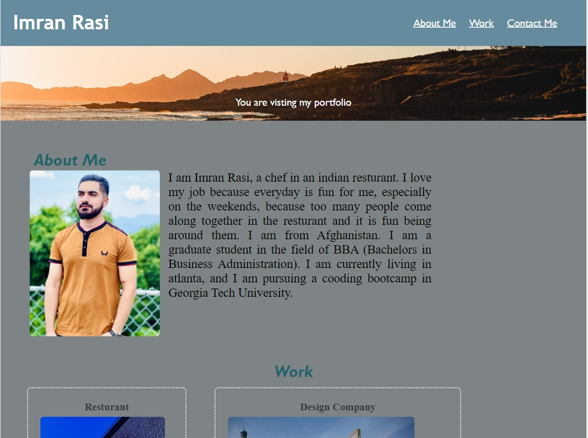

# <Imrans-Accessible-Portfolio>

## Description

The main goal of making this website is having my personal portfolio. Explaining about who am I and what I have done and doing. So by visiting that website visitors have a better look for my personal introduction, they can get info about me through visiting my portfolio.

## Installation

At first I made a repository in github then clone it to my computer through the terminal. I used vs code to make the html and css more readable, by using css I edited and gave style to my website unless the visitor get interest from visiting my portfolio. These are some starting process of my work:

1. Create a new repository on your GitHub account and clone it to your computer.
2. When you're ready to deploy, use the git add, git commit, and git push commands to save and push your code to your GitHub repository.

## Usage

You can read every section of this website and it shows how a business can grow using tools shown in the website.

## Credits

The websites thst I used to refernce:
1. https://www.w3schools.com/
2. https://developer.mozilla.org/
3. https://youtube.com/
4. https://google.com/

## License

MIT License

Copyright (c) 2022 Imran rassi

Permission is hereby granted, free of charge, to any person obtaining a copy
of this software and associated documentation files (the "Software"), to deal
in the Software without restriction, including without limitation the rights
to use, copy, modify, merge, publish, distribute, sublicense, and/or sell
copies of the Software, and to permit persons to whom the Software is
furnished to do so, subject to the following conditions:

The above copyright notice and this permission notice shall be included in all
copies or substantial portions of the Software.

THE SOFTWARE IS PROVIDED "AS IS", WITHOUT WARRANTY OF ANY KIND, EXPRESS OR
IMPLIED, INCLUDING BUT NOT LIMITED TO THE WARRANTIES OF MERCHANTABILITY,
FITNESS FOR A PARTICULAR PURPOSE AND NONINFRINGEMENT. IN NO EVENT SHALL THE
AUTHORS OR COPYRIGHT HOLDERS BE LIABLE FOR ANY CLAIM, DAMAGES OR OTHER
LIABILITY, WHETHER IN AN ACTION OF CONTRACT, TORT OR OTHERWISE, ARISING FROM,
OUT OF OR IN CONNECTION WITH THE SOFTWARE OR THE USE OR OTHER DEALINGS IN THE
SOFTWARE.
